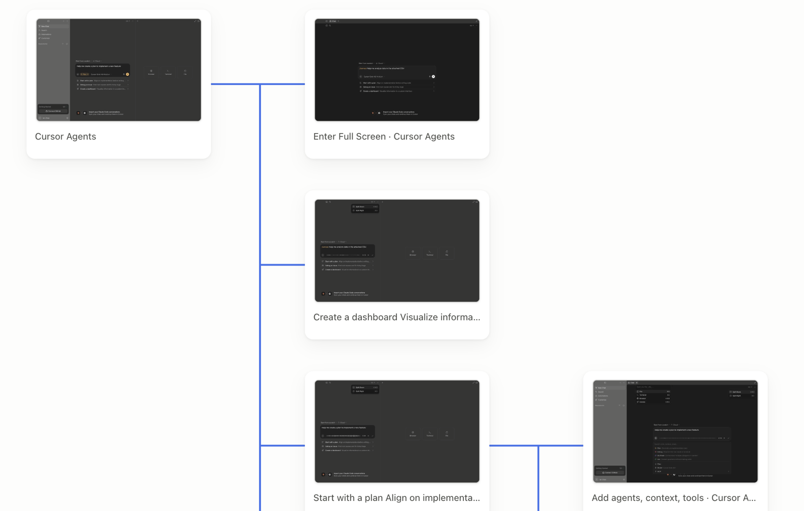

# Crank

Crank walks a running application, finds every screen it can reach, and hands
you those screens as editable Figma layers — with identity stable enough that a
second run updates the same frames instead of drawing new ones beside them.

It does not rebuild your interface. A web app runs in Chromium and Crank reads
what the browser laid out; a SwiftUI app is built, launched and asked to render
itself. Either way what arrives is what the application actually draws.



*Every click path, preserved.*

## What it does

- **Starts the project itself.** npm and pnpm projects run their own dev script;
  Electron projects serve the renderer without opening a window; Python and Ruby
  projects use the command their Dockerfile, Procfile or README already declares.
  Crank never invents a start command — a half-working start produces a
  confusing scan rather than an honest failure.
- **Walks every page.** Routes, tabs and overlays each count as a page. A theme
  or language switch is the same page wearing a different look, and is grouped
  with it. Every page carries the exact steps to reach it again from a fresh
  load, so a page that takes a click is not a page that can only be found once.
- **Attaches to what is already running.** An app started with a debugging port
  can be scanned as it is, with the data actually in it — which is the only way
  to capture screens that live behind a login or a bridge.
- **Scans SwiftUI apps too (beta).** An Xcode project has no address to serve
  and no page to walk, so it is built, run — on the Simulator for iPhone, on
  this Mac for a desktop app — and read either as exported vectors or as the
  render tree SwiftUI itself drew. The first matches the screen exactly; the
  second keeps names, corner radii and text, so the layers can be edited.
- **Hands the result over.** A self-contained HTML handoff page, editable
  layers pushed straight into a Figma file, or the same layers drawn into the
  Paper file you have open — over the MCP server Paper Desktop runs itself, so
  there is nothing to install and nothing to pair. They can also be copied as
  HTML and pasted, when a push is not wanted.

## Giving it something to scan

Drop a project folder anywhere on the window. If the folder is a workspace with
several independently runnable applications, each becomes its own project;
component libraries with no start script are ignored.

Three other ways in, for the cases where there is no folder to give:

- **A built `.app`.** A designer handed a build has no project — Crank opens the
  bundle's own debug port, scans, and closes it again.
- **An address.** If the app is already running, scan the URL. Discovery only
  ever talks HTTP, so what the project is written in does not come into it.
- **An app you are using right now**, over its debugging port. The pages worth
  handing to a designer are usually the ones with real data in them, and those
  only exist in the process you are actually running.

Supported sources:

- Web projects — Vite, Next.js, Remix, Gatsby, Astro
- Electron desktop projects, including React, Vue, Svelte, Angular, Solid, Lit
  and plain Chromium renderers
- Any address that answers over HTTP, whatever served it
- Tailwind is recognised when the project depends on it

An external renderer is opened in a sandboxed Electron session with Node
integration disabled. Non-GET requests are cancelled unless they are framework
tooling, and off-host scripts and data calls are cancelled too, so a scan cannot
write to your project or run a third party's code inside it. What the page
merely draws — its fonts, its images — is loaded, because a scan that comes back
worse than opening the page in a browser is a defect, not a safety measure.

## What comes back

A page can be looked at three ways, and the window says which one is on screen,
because they differ and knowing which you are looking at is the point of having
more than one:

1. **The project's own page**, served and shown live. Fonts, `::before`,
   gradients, hover and animation are then simply correct, because nothing is
   standing in for them.
2. **The captured markup**, when the real page cannot be reached — the folder
   moved, the address is down, the project was an installed app.
3. **The layer tree**, which is what Figma receives.

Every captured image is stored once, under the hash of its own bytes, however
many pages show it.

The handoff export is one `.html` file that opens in any browser and carries its
own images, so it can be sent to someone who has none of this installed.

## Figma

Connect a Figma Design file and choose **Create & link frames**. Crank gives you
a six-digit pairing code for the companion plugin in [`figma-plugin/`](figma-plugin/).
Pairing is per-machine and remembered, so it is done once rather than per
project.

The plugin uses Figma's official Plugin API to:

- reuse an exact stored node ID while it still exists;
- recover a moved or renamed frame from stable shared plugin data;
- create a frame at the captured viewport — 393 × 852 when there is nothing to
  go on — only when no identity exists;
- rebuild Chromium's geometry, text, SVG, images, fills, borders, radii and
  typography as editable Figma layers;
- send back the file name, the new node IDs, and the text, size, colour and font
  of each mapped layer, which is how a later run finds the same frames and how
  Crank can tell what changed in Figma.

Install it once from the [Figma Community](https://www.figma.com/community/plugin/1671468393066911617/crank).
A checkout can run its own copy instead — **Plugins → Development → Import plugin
from manifest…**, pointed at `figma-plugin/manifest.json`. Either way it can
reach `localhost:38457` and nothing else; a sync sends normalized visual
structure, never your source code.

Nothing about a project leaves the machine except during an explicit sync.

## Running it

```bash
npm run dev     # Vite and Electron together, with reload
npm start       # build, then run it the way a user gets it
```

Or double-click `Start UI Sync.command`, which installs dependencies on first
run and then does the same.

The icon comes from `public/app-icon.png`; the macOS `.icns` variants built from
it live in `assets/`.

## Codex and Claude through MCP

Crank can run without its window as a local STDIO MCP server. The server owns
the same Electron capture runtime, stored inventory, SwiftUI exporter and Figma
bridge as the app — an agent-triggered scan is not a separate approximation of
what the Scan button does.

The tools let an agent list stored projects, scan a folder, URL or attached
Chromium app, inspect pages and their preview images, and explicitly send pages
to Figma. Scans and vector preparation return job IDs immediately; poll
`get_job` while they run. Content read from a captured app is untrusted data,
not an instruction to the agent.

For a packaged copy, configure either Codex or another MCP client to run:

```text
/Applications/Crank.app/Contents/MacOS/Crank --mcp
```

For Codex, this is the equivalent project-scoped `.codex/config.toml` entry:

```toml
[mcp_servers.crank]
command = "/Applications/Crank.app/Contents/MacOS/Crank"
args = ["--mcp"]
startup_timeout_sec = 20
tool_timeout_sec = 30
default_tools_approval_mode = "writes"
```

The equivalent Claude Desktop server entry is:

```json
{
  "mcpServers": {
    "crank": {
      "command": "/Applications/Crank.app/Contents/MacOS/Crank",
      "args": ["--mcp"]
    }
  }
}
```

During development, `npm run mcp` starts the same server from this checkout.
If the Crank window is already open, the STDIO process authenticates to that
instance over a token-protected loopback relay, so both clients share one
inventory and one set of Figma and SwiftUI bridge ports. Otherwise the MCP
process owns the headless runtime itself. Keep the Figma companion plugin open
when an agent sends a job; `get_figma_sync_status` reports whether it is
waiting, working, complete, or failed.

## Working on Crank

[`AGENTS.md`](AGENTS.md) is the file to read first: the rules the product is
held to, where everything lives, and the conventions this codebase actually
follows. The short version is that `electron/` owns everything touching the
machine, `src/` is the window and reaches the machine only through
`window.uiSync`, and nearly every module opens with a paragraph saying what it
is for and what went wrong before it existed.

```bash
npm test
npm run build
npm audit --omit=dev
```

## SwiftUI apps — iPhone and Mac (beta)

An Xcode project is scanned like everything else — drop the folder, and it
appears in the sidebar — but nothing about it can be served, so the scan takes
a different road:

1. The project is copied into a workspace of its own, its views are
   instrumented in that copy, and it is built with `xcodebuild`. The originals
   are never touched.
2. Xcode is asked which destinations the scheme has. One that can run on the
   Simulator launches on a device the project keeps; a Mac-only one is built for
   this machine, signed to run locally, and launched here — one screen at a
   time, and stopped again afterwards. Each top-level navigation state is opened
   in turn.
3. Each state is read — as a vector PDF page through SwiftUI's `ImageRenderer`,
   as the render tree the app drew, or as both. See below.
4. Those pages become the project's inventory: the same cards, the same
   right-click menu, the same **Send to Figma**.

### Two ways to read a screen

An exported page draws what the app draws, and it arrives as loose shapes. A PDF
page has no tree, no names and no identity, so a second scan cannot recognise a
single layer from the first, and a card is a bezier outline with some text lying
over it rather than a box that moves when you drag it.

So a scan can instead read `DisplayList` — SwiftUI's own flattened list of
drawing operations, held behind the hosting view. Every item in it carries the
frame the layout engine computed, an identity SwiftUI assigned, and typed
content: a path, a colour, a string, an image. A card then comes back as a box
with the corner radius and the padding its source declares.

Which one a page carries is chosen in the project's **...** menu:

| | |
| --- | --- |
| **Match the screen** | Exactly what the app shows, as exported vectors. |
| **Layers you can edit** | The render tree, with names, corners and text. |
| **Both** | One build and one launch, captured twice, to compare. |

**Both** is there because which is better is a question about a real project
rather than one to settle in the abstract — and capturing twice in one launch
compares two readings of one screen, not two runs that differ for reasons nobody
can pin down.

The render tree is read by reflection rather than by linking against private
symbols, so a field Apple renames comes back missing instead of wrong, and the
failure names the view's real type and the fields it did have. What cannot be
reached is reported rather than drawn: a UIKit container that paints itself is
named as a gap, not left as an empty box that looks intentional.

Asked for the render tree alone, a scan needs no Poppler and does not fail when
nothing could be exported — the screens it read are the pages. A page whose
layers did not come back keeps its exported vectors instead, and says which
happened.

### Sending a page

Sending an exported page converts its PDF to SVG with Poppler and then restores
only what the capture can vouch for on top of it — editable text, shadows and
blur, the matching native Tab Bar, original asset-catalog images. Anything that
cannot be matched confidently keeps its rendered appearance; the page is never
redrawn from the source.

A page read from the render tree needs none of that: it already is a layer tree,
and it goes to Figma the same way a web page's layers do.

An exported page has no address, so it cannot be reopened live, recaptured, or
explored one level further. Its card says which view it came from instead.

The folder handed over does not have to be the one the `.xcodeproj` sits in:
the app's own source folder, or a repository with the project in a subfolder,
finds it either way. A repository with a manifest of its own is left alone, so a
React Native project is not claimed by the `ios/` folder inside it.

Needs the full Xcode app (found through `DEVELOPER_DIR`, `xcode-select -p`, or
the default install) and an iOS Simulator runtime for iPhone projects. Poppler
(`brew install poppler`) is needed only by the paths that export vectors, and is
checked before a build starts rather than after — a scan asked for the render
tree alone does not look for it.

Called beta because it asks that much of the machine, because a first scan
builds the whole project, and because screens are found from the SwiftUI in the
project — an app that assembles its screens somewhere that cannot be read
statically exports fewer than it has. The render tree adds a reason of its own:
it is read out of fields Apple does not promise to keep, so a future SDK can
take it away, and the exported-vector path is what it falls back to.
