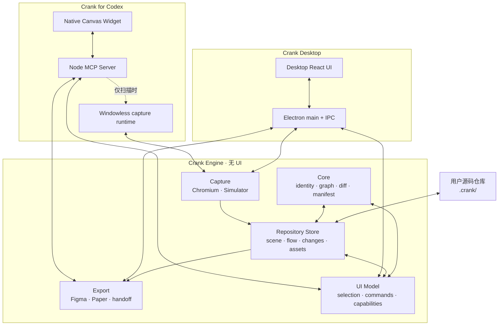

# Crank Desktop 与 Crank for Codex 共享引擎架构

## 结论

可以分开，而且应该分开。

目标不是把 Crank Desktop 塞进 Codex，也不是在 Codex Widget 里重新实现一份不相干的 Crank。正确形态是：

- **Crank Desktop** 是独立安装、独立启动、独立发布的桌面产品。
- **Crank for Codex** 是独立安装、独立启动、独立发布的 Codex Plugin，由 MCP Server、Skill 和 Native Widget 组成。
- 两者依赖同一套 **Crank Engine**，使用同一套仓库数据格式、页面身份、Flow 语义、捕获结果和导出协议。
- 两套 UI 可以针对宿主分别设计；核心行为不能各写一遍。
- 插件不能要求用户已经安装或启动 Crank Desktop。
- Desktop 也不能要求 Codex 存在。

推荐先在同一个 Git monorepo 中把它们拆成两个 app package，而不是立刻拆成两个 Git 仓库。这样已经可以独立构建和发布，同时共享引擎仍能原子修改、统一测试。等共享协议稳定后，如果组织或发布流程需要，再把 package 拆到不同仓库。

## 产品边界

这里的“分开”有三层含义，不能混在一起。

### 1. 产品分开

| 项目 | Crank Desktop | Crank for Codex |
| --- | --- | --- |
| 安装单元 | macOS/Windows/Linux 桌面应用 | Codex Plugin 包 |
| 启动方式 | 打开 Crank.app 或桌面命令 | 在 Codex 中调用 `open_crank_canvas` |
| UI 宿主 | Electron renderer | Codex MCP Native Widget |
| 后端宿主 | Electron main process | Node MCP sidecar；需要扫描时才启动无窗口 capture runtime |
| 是否依赖对方 | 否 | 否 |
| 发布版本 | 独立版本 | 独立版本 |

### 2. 用户的源码项目分开

每个被 Crank 打开的源码仓库都有自己的 `.crank/` 工作区。A 项目的 Map、布局、选择和改动不能泄漏到 B 项目。

```text
project-a/
  .crank/
  src/

project-b/
  .crank/
  src/
```

Desktop 与 Codex 在打开同一个仓库时可以读取同一份 `.crank/` 数据；打开不同仓库时自然隔离。

### 3. 设备级设置与仓库数据分开

以下内容适合放在仓库中：

- 页面和 Flow 的稳定身份
- 当前 Map/Screens 视图
- 节点视觉位置
- observed graph 与 intent graph
- 对源码的 `SourceRef`
- 已暂存但尚未实现的 change manifest
- 本项目捕获所需的本地 assets

以下内容不应提交到项目的 `.crank/`：

- Figma 的设备配对密钥或临时 pairing code
- 用户访问令牌
- Electron 窗口大小和桌面级最近项目列表
- Codex 任务 ID、会话 ID 或宿主私有状态

这类数据由各宿主自己的用户数据目录管理。

## 推荐架构

Crank for Codex 属于 `interactive-decoupled` MCP App：Widget 长时间保持交互状态，MCP Server 暴露受控能力，共享引擎负责真正的数据和业务规则。



核心原则是：**共享能力和数据规则，不强行共享整个界面。**

Desktop 和 Codex 的可用空间、窗口生命周期、全屏能力、键盘焦点、资源协议和安全限制都不同。如果强行共用一个 React 页面，宿主适配会渗入所有组件，最后仍然形成大量条件分支。应当共享 headless model、commands、graph logic 和可复用的纯视觉组件，但分别保留两个 shell。

## 各层职责

### `crank-core`

纯 JavaScript/TypeScript，不依赖 Node、Electron、DOM、React 或 Codex bridge。

职责：

- 页面、节点、连线和源码引用的稳定身份
- inventory 到 observed graph 的转换
- observed graph 与 intent graph 的隔离
- screen/transition 的新增、删除、修改和重连
- graph diff 与 change manifest
- Map 自动布局的确定性规则
- schema 版本与迁移所需的纯数据转换

当前已经属于这一层的主要代码：

- `shared/app-graph.js`
- `shared/inventory-app-graph.js`
- `shared/flow-layout.js`
- `shared/annotation-context.js`

这层必须有一套宿主无关的 conformance tests。Desktop 和 Codex 不应该分别测试“自己的 graph 规则”，而应该共同通过同一组行为测试。

### `crank-storage`

负责仓库内 `.crank/` 的读写，不负责 UI，也不负责扫描。

职责：

- Zod 校验所有读入数据
- 原子写入，防止进程中断留下半个 JSON
- `schemaVersion` / `stateVersion` 管理
- asset 索引和安全路径解析
- 并发写入冲突检测
- 向旧版本数据提供显式迁移

当前 `electron/repo-canvas-store.cjs` 已经实现了版本化、Zod 校验、原子写入和仓库路径限制，是这一层的起点。它不应长期留在名为 `electron/` 的目录中，因为 Codex MCP Server 也需要它，而它本身并不属于 Electron UI。

### `crank-capture`

负责从代码得到真实页面观察结果。

职责：

- 启动和发现 runnable app
- Served project 的沙盒 Chromium 抓取
- iOS 项目的 Simulator 构建、启动和 vector PDF 抓取
- DOM/layer tree、图片、字体、链接、点击路径和 `SourceRef` 收集
- 将捕获结果写入统一 inventory/asset store

两种产品共用捕获实现，但运行适配不同：

- Desktop 直接从 Electron main process 调用。
- Codex Plugin 的 Node MCP sidecar 在需要扫描时才启动随插件打包的无窗口 Electron runtime。

因此插件可以独立扫描，却不会打开 Crank Desktop 窗口，也不依赖 `/Applications/Crank.app`。

### `crank-export`

负责把同一份 inventory 转成外部工具需要的格式。

职责：

- 可编辑 DOM / structured page 的标准化
- Figma bridge job 与 frame identity
- Paper copy/push payload
- 独立 handoff 页面或其他未来 export adapter

Figma 和 Paper 是共享能力，不应该被定义成“桌面版功能”。两个产品都可以调用同一 export service，只是入口 UI 不同。任何发送仍必须是用户明确操作；打开 Map 或读取仓库绝不能隐式同步 Figma。

### `crank-ui-model`

这是两个 UI 之间真正值得共享的部分，而不是一整个页面组件。

职责：

- 当前 selection
- 可用 commands 和 command enablement
- Map/Screens/detail 的状态转换
- viewport 与节点布局状态
- “视觉移动”和“产品意图修改”的严格区分
- 保存节流、撤销语义和冲突反馈

例如，拖动 screen 节点只更新 `scene.json`；重连 transition 必须更新 `intentGraph`。这条规则应由共享 command 保证，而不是依赖两个 React 组件都写对。

### Desktop adapter

Desktop adapter 只负责 Electron 特有的事情：

- IPC / preload bridge
- macOS 原生窗口和菜单
- 本地文件选择器
- desktop notifications
- 桌面窗口级生命周期

Desktop React UI 可以继续拥有适合桌面 App 的导航、侧栏和项目管理体验。

### Codex adapter

Codex adapter 由三个部分组成：

1. Plugin manifest/skill：告诉 Codex 何时和如何使用 Crank。
2. MCP Server：暴露工具、读取仓库、调用共享引擎、提供 UI resource。
3. Native Widget：显示 Map、Screens 和 detail，并通过 MCP Apps bridge 调工具。

Widget 不直接读磁盘，不依赖 Electron 自定义协议，也不持有捕获注册表的绝对路径。它只接收经 MCP Server 校验和裁剪的数据。

## 建议目录结构

这是目标结构，不要求一次性搬完：

```text
apps/
  desktop/
    main/
    preload/
    renderer/
    package.json
  codex-plugin/
    server/
    widget/
    skill/
    .codex-plugin/
    package.json

packages/
  core/
  storage/
  capture/
  export/
  ui-model/
  schemas/

integrations/
  figma-plugin/
  paper/

scripts/
  build-desktop.*
  build-codex-plugin.*
```

当前目录可以渐进映射：

| 当前目录或文件 | 目标位置 |
| --- | --- |
| `shared/app-graph.js` | `packages/core/graph` |
| `shared/inventory-app-graph.js` | `packages/core/inventory` |
| `shared/flow-layout.js` | `packages/ui-model/layout` 或 `packages/core/layout` |
| `electron/repo-canvas-store.cjs` | `packages/storage` |
| `electron/*capture*.cjs` 及 browsing modules | `packages/capture` |
| Figma/Paper job logic | `packages/export` + `integrations/` |
| `src/ScreenFlow.tsx` | `apps/desktop/renderer` |
| `codex/src/FlowCanvas.tsx` | `apps/codex-plugin/widget` |
| `electron/mcp-server.cjs` | `apps/codex-plugin/server` |
| `electron/mcp-standalone-entry.cjs` | `apps/codex-plugin/server` |
| `scripts/build-crank-plugin.mjs` | Codex plugin 独立构建脚本 |

迁移后，任何 package 名称都不应暗示共享引擎属于 Desktop。尤其是 `repo-canvas-store` 和 MCP server 不应长期放在 `electron/` 下。

## `.crank/` 数据协议

现有仓库工作区是正确方向：

```text
.crank/
  scene.json
  flow.json
  changes.json
  assets/
    index.json
    ...
```

### `scene.json`

只保存视觉工作区状态：

- 当前 inventory ID
- Map 或 Screens 视图
- 是否显示缩略图
- 节点位置
- 当前 selection
- viewport（如果以后加入，应与宿主窗口尺寸解耦）

节点拖动、缩放、选中和打开 detail 不应产生产品改动。

### `flow.json`

保存两张图：

- `observedGraph`：扫描实际观察到的事实，只能由扫描/同步更新。
- `intentGraph`：用户希望产品变成的状态，可由 Desktop 或 Codex 编辑。

所有 UI 都必须遵守：

```text
scan/sync  ──> observedGraph
                  │ clone/rebase
                  v
user edits ──> intentGraph ──> manifest ──> Codex/source implementation
```

不能因为用户拖动节点就改变 intent；不能因为用户删除一条 intent transition 就删除 observed evidence。

### `changes.json`

保存已经明确提交给 Codex/实现流程的 manifest。它不是任意点击产生的 note，也不是 UI selection 日志。

只有真正的产品意图变动或明确保存的 annotation 才进入 changes。仅选择页面、节点、连线或打开大图，只更新 selection，不生成消息或 change。

### `assets/`

保存当前仓库所需的本地页面预览和可复用图片。Widget 不能通过 `crank-asset://` 访问它们；MCP Server 应通过 tool result/resource 返回受控的 data URL、blob 或结构化页面文档。

## 并发与冲突

允许 Desktop 和 Codex 打开同一个仓库，不等于允许它们无条件覆盖彼此。

有两类共享状态，处理方式不同，不能混为一谈：

- **版本化数据** —— `.crank/` 里的 JSON。两个宿主都能读写，冲突表现为「谁的写入生效」，用 `stateVersion` + `baseStateVersion` 解决。
- **独占资源** —— 同一时刻只能有一个使用者的东西。冲突不是覆盖，而是双方都用不了。版本号对这类完全无效，必须先声明占用。

### 版本化数据

推荐所有可写文件带：

- `schemaVersion`：文件格式版本
- `stateVersion`：每次成功写入递增
- `updatedAt`：诊断信息，不作为冲突依据
- 可选 `writer`：`desktop` 或 `codex`，只用于诊断

写入流程：

1. UI 读取版本 N。
2. 用户在内存中编辑。
3. 保存时提交 `baseStateVersion: N`。
4. store 发现磁盘仍是 N，原子写入 N+1。
5. 如果磁盘已经是 N+1 或更高，拒绝静默覆盖，返回 conflict。
6. UI 重新读取并按类型处理：视觉布局可合并，intent graph 必须显示冲突或执行确定性 rebase。

第一阶段至少应做到版本比较和拒绝覆盖。不要用“最后写入者获胜”处理 flow intent。

### 独占资源

`.crank/` 之外还有一批共享可变资源，它们不是文件内容，而是「同一时刻只能有一个使用者」的东西：

| 资源 | 冲突表现 |
| --- | --- |
| 设计构建工作区 / DerivedData | Xcode 的 `build.db` 被锁，构建失败 |
| 本地服务端口 | 后启动的一方绑定失败，功能静默失效 |
| 模拟器设备 | 两次构建互相顶掉对方启动的 App |
| asset store 的清扫 | 一方在删无人引用的图片，另一方正要引用它们 |

这类冲突**不是**「谁的写入生效」，而是双方都做不成，而且报错来自底层工具，读起来和架构无关。工作区那次的实际输出是：

```text
error: unable to attach DB: accessing build database ".../build.db":
database is locked. Possibly there are two concurrent builds running in
the same filesystem location.
```

准确，但要在几秒钟的构建日志之后才出现，且完全没提示「另一个宿主正在做同一件事」。

规则：**任何位于 `.crank/` 之外、同一时刻只能有一个使用者的资源，使用前必须声明占用，而不是靠版本号协调。** 声明失败时报出是谁占着，而不是让底层工具去发现。

一份可用的实现在 `electron/design-build-lock.cjs`（构建工作区）：

- 用 `open(..., "wx")` 原子创建锁文件，记下 pid、开始时间和占用者身份
- 占不到时报出持有者是「Crank 窗口」还是「通过 MCP 的 agent」
- 持有进程已消失 → 接管，崩溃的构建不能永久卡死一个项目
- 持有超过阈值 → 视为卡死并接管
- 锁文件损坏读不出 → 视为失效，否则就成了没人能解的锁
- 自己的锁被别人接管后，自己释放时不删对方的锁

端口是同一类问题的另一面，而且当前是四个硬编码常量（Figma bridge、SwiftUI runtime、MCP relay、display-list bridge）。两个宿主同机运行必然相撞，且失败方式是静默的——只在启动日志里留一行。硬编码常量不是分配策略：要么由 engine 统一分配并让宿主互相发现，要么全部改为 0 端口加服务发现。这一条尚未解决。

## 共享 API

共享引擎应提供面向用户意图的 API，而不是把 Electron IPC 或 MCP tool 当成领域接口：

```ts
openWorkspace(repositoryRoot)
openCanvas({ inventoryId? })
getScene()
getSelection()
getFlowSelection()
getSourceContext(sourceRef)
saveScene(scene, baseStateVersion)
applyIntentCommand(command, baseStateVersion)
prepareChangeManifest()
syncFromCode(options)
prepareFigmaExport(options)
preparePaperExport(options)
```

Desktop IPC 和 Codex MCP tools 都只是这些 API 的 adapter。

Codex 的外部工具仍应保持“一种用户意图一个工具”。建议稳定工具面为：

| Tool | 类型 | 作用 |
| --- | --- | --- |
| `open_crank_canvas` | 只读/渲染 | 读取当前仓库已有 `.crank` 并打开 Widget，不扫描 |
| `get_selection` | 只读 | 返回当前选中 screen/node/edge 的最小上下文 |
| `get_flow_selection` | 只读 | 返回选中 Flow 的语义上下文 |
| `get_source_context` | 只读 | 返回经过仓库边界校验的源码片段 |
| `save_canvas_state` | 本地写入 | 保存视觉状态或 intent command |
| `sync_from_code` | 明确动作 | 扫描代码并更新 observed graph |
| `prepare_flow_changes` | 明确动作 | 生成 manifest，不直接改代码 |
| `send_to_figma` | 外部写入 | 用户明确要求后创建 Figma job |
| `copy_for_paper` / `push_to_paper` | 外部动作 | 用户明确要求后准备或发送 Paper 内容 |

`open_crank_canvas` 绝不能偷偷调用 `sync_from_code`；`prepare_flow_changes` 绝不能偷偷同步 Figma。

## UI 共享策略

### 应共享

- graph/scene TypeScript types
- Zod schemas
- selection model
- intent commands
- layout algorithm
- edge routing/handle 选择规则
- PageLayers 等真正宿主无关的内容渲染组件
- locale keys 与双语文案
- 颜色、间距、圆角等 design tokens
- 交互 conformance tests

### 不应强行共享

- Desktop 的整页 shell、sidebar 和 title bar
- Codex 的 display mode/fullscreen 请求
- Electron IPC hook
- MCP postMessage bridge
- Desktop 自定义 asset protocol
- Codex 宿主专属 annotation/context 更新

如果某个组件内部同时出现 `window.uiSync` 和 MCP bridge，它已经跨越了错误边界，应拆成纯组件和两个 adapter。

## 功能归属

| 能力 | 共享引擎 | Desktop UI | Codex UI |
| --- | --- | --- | --- |
| 打开已保存 Map | 是 | 入口 | `open_crank_canvas` |
| 扫描源码 | 是 | Desktop adapter | MCP + windowless runtime |
| Map / Screens | graph + scene | 桌面布局 | Codex 宿主布局 |
| 页面矢量详情 | page document | 独立窗口/面板 | Widget detail/fullscreen |
| screen/transition intent 编辑 | 是 | 桌面控件 | Widget 控件 |
| SourceRef 与 selection | 是 | IPC adapter | MCP context adapter |
| Codex 标注闭环 | annotation data | 可提供跳转 | Codex 专属体验 |
| Figma | export + bridge | 桌面入口 | Widget 入口 |
| Paper | export adapter | 桌面入口 | Widget 入口 |
| 项目列表/最近打开 | 否 | Desktop 专属 | 使用当前 Codex repo |

功能可以同时存在于两个产品，不等于 UI 必须一模一样。验收应检查相同输入是否产生相同 graph、manifest 和 export payload，再分别验收宿主 UI。

## 独立构建与发布

建议使用 workspace package 和独立产物：

```text
npm run build:engine
npm run build:desktop
npm run build:codex-plugin
npm run test:conformance
```

### Desktop 产物

- Electron app bundle
- Desktop renderer assets
- capture runtime（Electron 本身）
- 共享 engine 的锁定版本

### Codex Plugin 产物

- `.codex-plugin/plugin.json`
- skill
- Node MCP server bundle
- 单文件或自包含 Widget resource
- 按平台打包的无窗口 capture runtime
- 共享 engine 的锁定版本

Plugin 包内不能引用源码 checkout，也不能引用 Desktop 安装目录。Widget resource URI 应带版本；更新插件后旧任务可能仍持有旧 resource URI，因此 server 应只声明当前包中真实存在的资源，并在兼容窗口内保留必要 alias 或让宿主建立新连接。

Desktop 版本和 Plugin 版本可以不同，例如：

```text
Crank Desktop 0.5.0
Crank for Codex 0.4.3
Crank Engine 0.4.x
Crank workspace schema 1
```

关键不是版本号相同，而是声明兼容的 engine/workspace schema 范围。

## 安全与边界校验

- 所有 MCP input/output、IPC payload、`.crank` 文件和 capture runtime 数据都用 Zod 校验。
- `SourceRef` 必须 resolve 后仍位于当前 repository root 内。
- asset key 不能直接成为文件路径。
- Widget 不接收无需展示的绝对路径、令牌和配对密钥。
- 扫描沿用隔离 Chromium 策略；插件不能因为没有桌面窗口就降低 sandbox 要求。
- Figma/Paper 属于显式外部动作，工具 metadata 和 UI 都要准确标识副作用。
- 打开、浏览、选择、缩放和拖动不产生外部副作用。

## 迁移计划

### 阶段 0：冻结共享行为

- 为 inventory → graph、layout、reconnect、diff、manifest 建立统一 conformance tests。
- 为 `.crank` schema 和迁移建立 fixture tests。
- 建立 Desktop/Codex 功能矩阵，明确哪些是共同能力、哪些是宿主能力。

完成标准：同一 fixture 在 Desktop adapter 和 MCP adapter 下得到同一 observed graph、intent graph 和 manifest。

### 阶段 1：抽出 storage 和 schemas

- 将 `repo-canvas-store` 从 `electron/` 移到共享 package。
- 保留 CommonJS adapter 或改为 dual ESM/CJS build，避免一次性破坏 Electron main。
- 增加 optimistic concurrency；补充迁移和损坏文件错误。

完成标准：Desktop 和 MCP server 都只通过同一个 store API 读写 `.crank`。

### 阶段 2：抽出 capture service

- 将扫描编排与 Electron window 生命周期分离。
- Desktop adapter 和 windowless runtime 调同一 capture service。
- 捕获产物、资产缺口和 fallback 报告完全一致。

完成标准：同一项目在两种宿主下产生相同 inventory schema 和稳定页面 ID。

### 阶段 3：统一 UI model/commands

- 把 selection、intent mutation、reconnect 和 scene-only move 提取为共享 commands。
- Desktop 与 Codex 各自保留 shell，只消费相同 commands。
- 把可复用的 PageLayers、edge routing 和 design tokens 下沉。

完成标准：两个 UI 不再各自手写 graph mutation。

### 阶段 4：统一 export

- Figma、Paper 和 handoff 使用统一 preparation service。
- 宿主只处理用户入口、进度和外部 app 打开动作。
- 明确区分 copy、prepare、push/send 的副作用。

完成标准：同一 inventory/page selection 产生字节或语义等价的 export payload。

### 阶段 5：真正独立发布

- Desktop build 不包含 Codex Widget/MCP server，除非作为开发测试依赖。
- Codex Plugin build 不包含 Desktop renderer，也不启动 Desktop window。
- CI 分别构建、测试、签名和发布两个产物。
- 发布说明分别维护，workspace schema 兼容性统一维护。

完成标准：干净机器只安装其中任意一个产品，都能完成其声明的流程。

## 验收标准

### 共享引擎

- 相同 inventory 得到相同 screen IDs、observed edges 和自动布局。
- observed graph 始终不可由用户编辑覆盖。
- screen/transition 编辑只进入 intent graph。
- 移动节点只改变 scene。
- manifest 在两个宿主中语义一致。
- Figma/Paper preparation 结果一致。

### Crank Desktop

- 未安装 Codex 时可打开、扫描、编辑、导出。
- 桌面项目管理、窗口和 Figma 配对正常。
- 不加载 Codex Widget 作为主 UI。

### Crank for Codex

- 未安装 Crank Desktop 时可打开已有 `.crank` Map。
- `open_crank_canvas` 不重新扫描。
- 明确执行 `sync_from_code` 时可由自带 runtime 扫描。
- Widget 可显示真实 preview 和 page document，不依赖 `crank-asset://`。
- Map、Screens、detail、selection 和 intent 编辑在 Codex 宿主内可用。
- 只有真实改动或明确 annotation 才更新模型上下文/生成 change。
- Figma/Paper 只在用户明确操作后运行。

### 项目隔离

- 两个仓库的 `.crank` 不互相引用绝对路径或 inventory。
- 同一仓库被两个宿主同时打开时不会静默覆盖 intent。
- schema 不兼容时给出可操作错误，而不是空白画布。

## 不做的事情

- 不把 Electron 窗口 iframe 到 Codex。
- 不为了“共用 UI”让 Widget 依赖 Node、磁盘或 Electron protocol。
- 不让 Desktop 和 Codex 各维护一套 graph/diff/manifest 规则。
- 不在打开 Map 时自动扫描。
- 不在扫描或打开 Map 时自动同步 Figma。
- 不立即拆成多个 Git 仓库并通过复制源码维持共享。
- 不扩展 dormant `src/App.tsx` 或 dormant SwiftUI runtime 来承载这次架构拆分。

## 当前实现与目标的差距

当前已经有：

- `shared/` 中的 graph、diff、layout 和 annotation context。
- 仓库级 `.crank/scene.json`、`flow.json`、`changes.json`、`assets/`。
- 独立 Node MCP sidecar 和 Codex Native Widget。
- 插件自带的无窗口 Electron capture runtime。
- Codex 中的 Figma/Paper 工具入口。

仍需收敛：

- `repo-canvas-store` 和 MCP server 仍位于 `electron/` 命名空间。
- Desktop `ScreenFlow` 仍保留部分自己的 graph/layout 推导，需要改为共享 commands/model。
- 根 `package.json` 仍把 Desktop 与 Codex build 串在一个应用包里，还不是真正独立的 package/release。
- 并发写入目前有 `stateVersion`，但还需要 `baseStateVersion` 检查才能防止两个宿主静默覆盖。
- 独占资源只覆盖了构建工作区一处。端口仍是硬编码常量，模拟器设备和 asset 清扫尚无占用声明。
- 共享 schema、engine version 和 workspace compatibility 还没有形成独立发布契约。

因此，架构方向已经成立，但“两个独立项目”还需要按上述阶段完成 package 和 release 边界。

## 决策摘要

1. **两个产品项目分开。** Desktop 与 Codex Plugin 独立安装、启动、构建和发布。
2. **共享引擎。** identity、capture、storage、graph、manifest 和 export 只保留一个事实来源。
3. **UI shell 分开。** 不嵌入 Desktop；共享 headless model、commands 和必要组件。
4. **仓库数据共享。** 同一源码仓库通过 `.crank/` 在两个宿主间连续工作。
5. **用户项目隔离。** 每个 repo 一份 `.crank`，设备凭据留在宿主 user data。
6. **先 monorepo，后按需要拆 Git repo。** 先获得独立产物和清晰边界，不用复制代码换取表面分离。

## 参考

- [OpenAI：Plugin architecture](https://developers.openai.com/plugins/architecture)
- [OpenAI：Build an MCP server](https://developers.openai.com/plugins/build/mcp-server)
- [OpenAI：Add UI to your MCP server](https://developers.openai.com/plugins/build/chatgpt-ui)
- [OpenAI：Define tools](https://developers.openai.com/plugins/plan/tools)
- [OpenAI：Plugin UI reference](https://developers.openai.com/plugins/reference)
